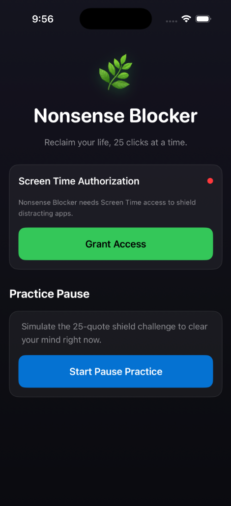
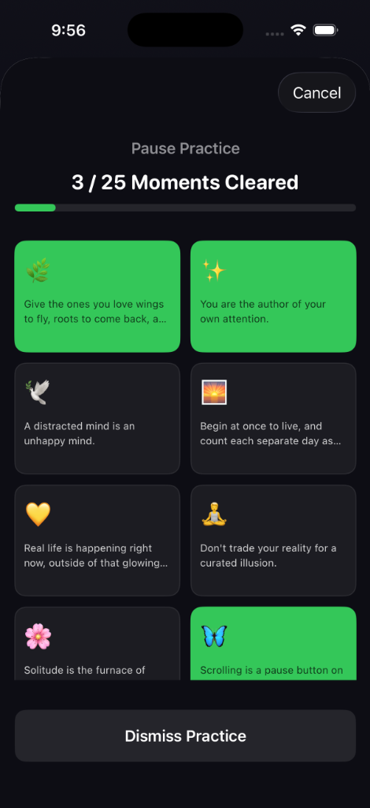

# ⚡ Installing on a Physical iPhone (Quick Install)

| 1. Main Dashboard | 2. 25-Quote Challenge Grid |
| --- | --- |
|  |  |

Use this guide to quickly install **Nonsense Blocker** onto your phone (or a friend's phone) using a Mac and Xcode.

### Step 1: Enable Developer Mode on the iPhone
1. On the iPhone, go to **Settings -> Privacy & Security**.
2. Scroll to the bottom and tap **Developer Mode**.
3. Toggle it **ON** and follow the prompts to restart the phone.
4. Once restarted, unlock the phone and tap **Turn On** when prompted.

### Step 2: Open the Project in Xcode
1. Clone this repository to your Mac.
2. Open the folder and double-click **`NonsenseBlocker.xcodeproj`** (blue blueprint icon) to open the project.

### Step 3: Connect the Phone & Sign the Targets
1. Connect the iPhone to the Mac using a USB cable.
2. Unlock the iPhone and tap **Trust This Computer**.
3. In Xcode, click the **blue project root file** `NonsenseBlocker` at the very top of the left sidebar.
4. For **each** of the three targets (`NonsenseBlocker`, `NonsenseBlockerShield`, and `NonsenseBlockerAction`):
   * Select the target under the **Targets** list in the left panel.
   * Go to the **Signing & Capabilities** tab at the top.
   * Under the **Team** dropdown, select your Apple ID / Personal Team. *(If you haven't logged in, click "Add an Account..." and sign in with your free Apple ID).*
   * Xcode will automatically register the iPhone and generate provisioning profiles.

### Step 4: Build and Install
1. In Xcode's top toolbar, click the device selector and choose **your physical iPhone** under the **iOS Devices** list.
2. Click the **Play (Run)** button (or press `Cmd + R`).
3. Xcode will build and install the app directly onto the phone.

### Step 5: Trust the Developer Certificate (First time only)
1. On the iPhone, try to open the newly installed **Nonsense Blocker** app. You'll see an "Untrusted Developer" warning.
2. Go to **Settings -> General -> VPN & Device Management**.
3. Under **Developer App**, tap your Apple ID email.
4. Tap **Trust [Your Email]** and confirm.

---

## 🛠️ Troubleshooting Signing Issues
If you see the warning *"Your team has no devices from which to generate a provisioning profile"* during **Step 3**:
* This is a restriction on free developer accounts. Make sure the iPhone is selected in Xcode's top device selector, and click **Try Again** under the warning in the Signing tab. Xcode will register it and clear the warning!

---

## 📂 Simulator & Developer Guide
For virtual Simulator testing, local unit-testing commands, and architectural layout details, see **[DEVELOPER.md](DEVELOPER.md)**.
